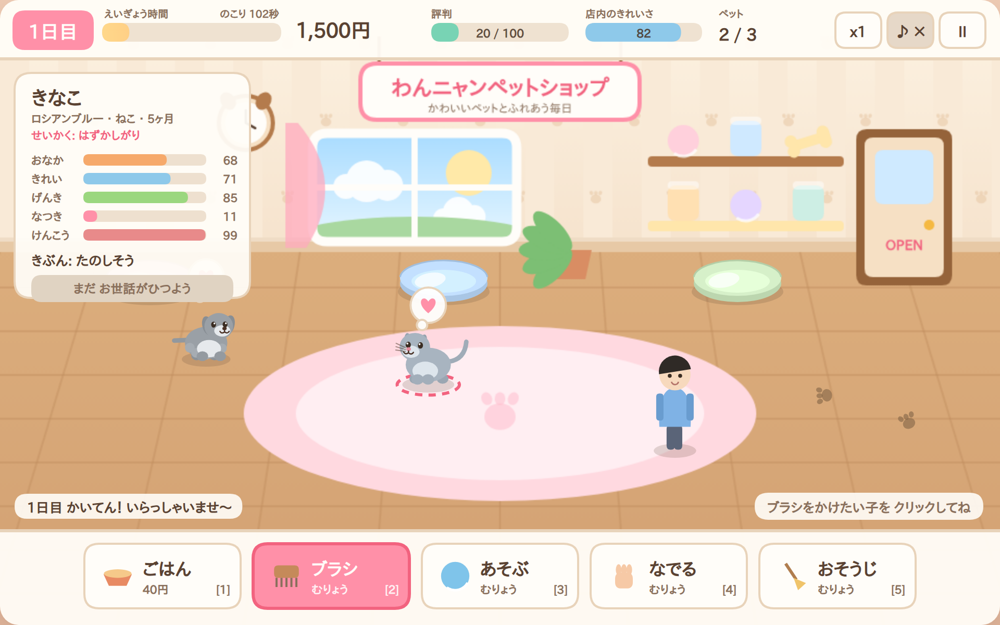
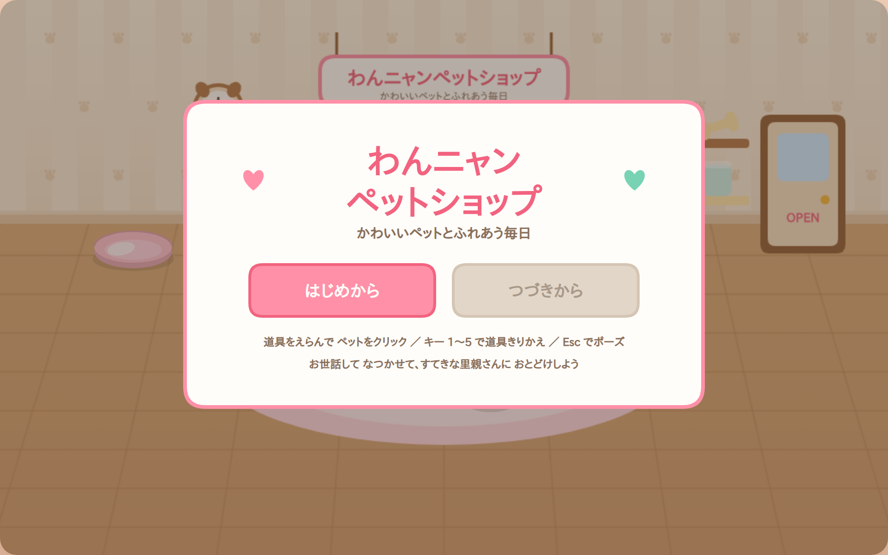
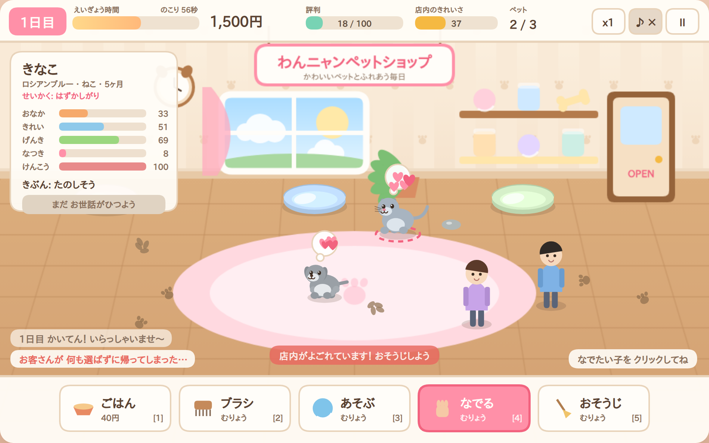
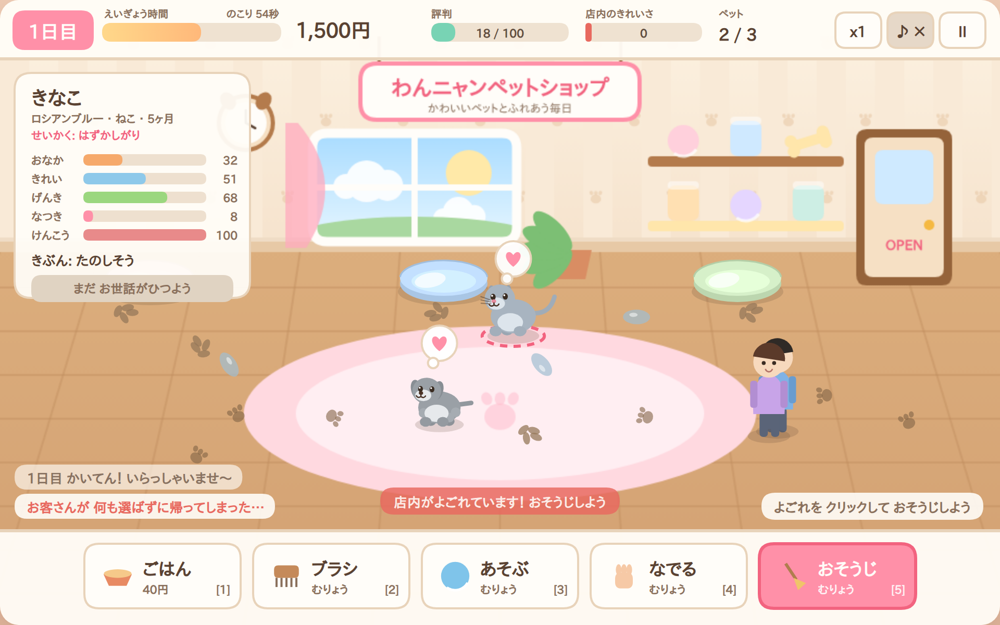
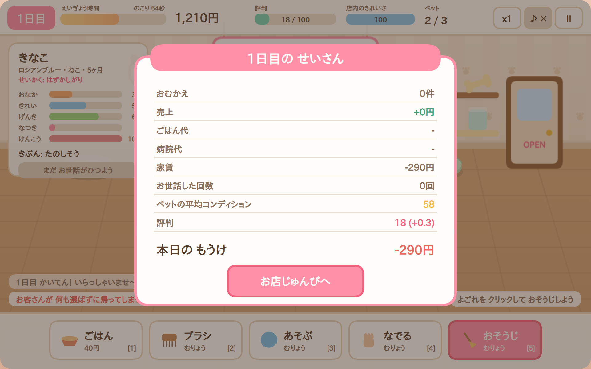
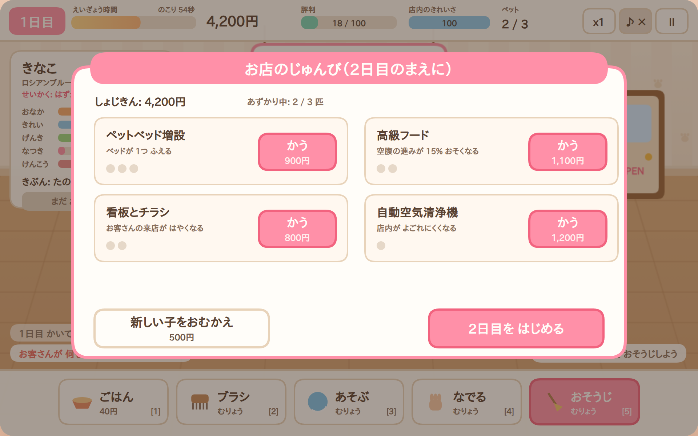
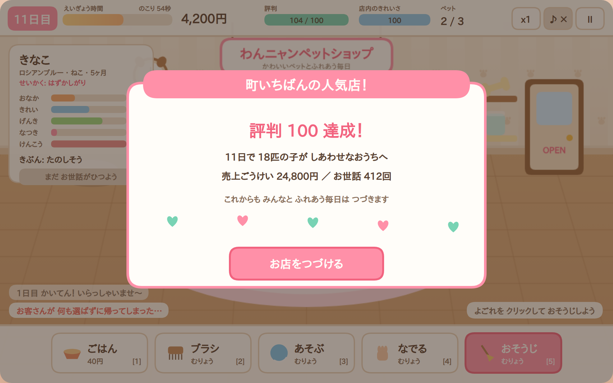

# わんニャンペットショップ — かわいいペットとふれあう毎日

ブラウザで動く、ペットショップ経営＆ふれあいゲームです。
子犬と子猫のお世話をして、なつかせて、すてきな里親さんのもとへ送りだしましょう。

**画像・音声・フォント・外部ライブラリを一切使いません。** ペットも店内も UI も
すべて Canvas 2D のベクター描画、効果音は Web Audio API の合成音。依存ゼロ・ビルド不要で、
`index.html` を静的配信するだけで動きます。



## あそびかた

```bash
npm start           # http://127.0.0.1:5180 で開く（node のみ、依存なし）
```

ブラウザで `index.html` を静的サーバー経由で開くだけでも動きます（ES モジュールを使うため
`file://` では動きません）。

### 操作

| 入力 | 動作 |
|---|---|
| 画面下の道具を選ぶ → ペットをクリック | お世話する |
| キー `1`〜`5` | 道具のきりかえ（ごはん / ブラシ / あそぶ / なでる / おそうじ） |
| `Esc` | ポーズ（セーブもされます） |
| `Space` | 画面おくり（タイトル・せいさん・じゅんび） |
| `M` | 音のオン・オフ |
| 画面右上 `x1` | 倍速きりかえ |

### ゲームの流れ

1. **開店（120秒）** — ペットのお世話をしながらお客さんを迎えます。
   - おなか・きれいさ・げんき・なつき・けんこう の 5 つが時間とともに減ります。
   - なつき度とコンディションが一定以上になると「おむかえOK」。お客さんが選んでくれます。
   - 状態が良いほど、なつくほど、評判が高いほど高く引き取られます。
   - 床のよごれを放置すると店内のきれいさが下がり、お客さんの足が遠のきます。
   - けんこうが 0 になると動物病院へ（600円）。死んでしまうことはありません。
2. **せいさん** — 売上・ごはん代・病院代・家賃を精算します。所持金がマイナスになると閉店（ゲームオーバー）。
3. **お店のじゅんび** — アップグレード購入と、新しい子のおむかえ。
4. 夜のあいだに空きベッドへ新しい子がやってきて、次の日へ。

**目標は評判 100。** 達成するとエンディングですが、そのあともお店は続けられます。

### アップグレード

| 名前 | 効果 | 段階 |
|---|---|---|
| ペットベッド増設 | あずかれる数 +1（最大 6匹） | 3 |
| 高級フード | 空腹の進みが 15% おそく | 2 |
| 看板とチラシ | 来店ペースが上がる | 2 |
| 自動空気清浄機 | 店内がよごれにくい | 1 |

## スクリーンショット

| | |
|---|---|
|  |  |
|  |  |
|  |  |

`npm run shots` で再生成できます（`screenshots/report.json` に生成ログ）。

## 構成

```
wan-nyan-pet-shop/
  index.html            エントリ（インライン CSS のみ）
  src/
    core/               Rng（決定的乱数）/ EventBus / Loop（固定タイムステップ）
    game/               ゲームロジック（DOM 非依存・すべてテスト可能）
      balance.js        調整値をすべて集約
      data.js           名前・犬種猫種・性格・セリフ
      pets.js           ペットの欲求・行動・お世話の判定
      customers.js      来店・品定め・価格計算
      state.js          全体の状態遷移（開店→せいさん→じゅんび→翌日）
      save.js           localStorage セーブ（storage は注入可能）
    render/             Canvas 2D 描画（palette / room / sprites / fx / hud / overlays / renderer）
    audio/              Web Audio による効果音合成
    main.js             入力・ループ・描画・音の結線と QA フック
  tests/
    unit/               node:test によるロジックテスト（ブラウザ不要）
    e2e/                Playwright で実ブラウザ操作テスト
  tools/
    serve.mjs           依存なしの静的サーバー
    capture.mjs         スクリーンショット自動撮影
    perf.mjs            パフォーマンス計測とレポート生成
    browser.mjs         Chromium 起動の共通処理
  docs/
    DESIGN.md           設計とバランスの意図
    TEST-REPORT.md      テスト一覧と結果
    PERFORMANCE.md      パフォーマンス計測レポート（自動生成）
```

### 設計の要点

* **ロジックと描画の完全分離** — `src/game/**` は DOM も Canvas も参照しません。
  そのため 10 日ぶんのプレイをテストの中で 1 秒未満でシミュレートできます。
* **固定タイムステップ 30 Hz** — 描画は可変フレームレート。フレームレートが変わっても
  ゲームの進みは変わりません。タブを離れても復帰時に暴走しません。
* **決定的な乱数** — シード値ひとつでプレイが再現でき、セーブにも状態ごと保存されます。
* **イベントバス経由の演出** — 音とパーティクルはロジックの結果を購読するだけ。
  ロジック側は音の存在を知りません。

## 開発コマンド

```bash
npm start           # ローカルサーバー
npm test            # ユニットテスト（ブラウザ不要・約1秒）
npm run test:e2e    # ブラウザ E2E テスト（Playwright + Chromium）
npm run shots       # スクリーンショット再生成
npm run perf        # パフォーマンス計測 → docs/PERFORMANCE.md
npm run verify      # 上記すべて
```

E2E・スクリーンショット・計測には Playwright が必要です（リポジトリルートの
`node_modules` を参照します）。環境変数 `CHROMIUM_PATH` で Chromium の場所を指定できます。

## 対応ブラウザ

Canvas 2D・ES モジュール・`localStorage` が動く最近のブラウザ。
Web Audio が無い環境でも音が鳴らないだけで、ゲームは通常どおり動きます。
`localStorage` が使えない環境（プライベートモード等）ではセーブが無効になるだけです。
